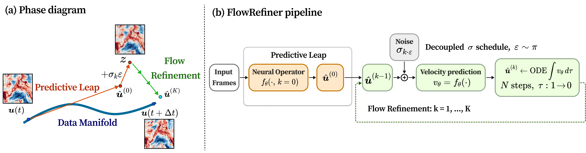
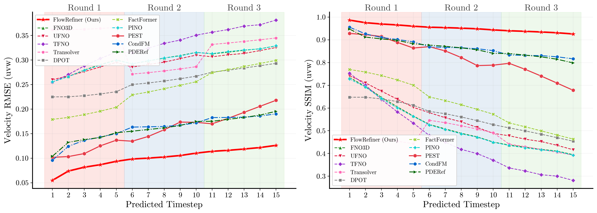
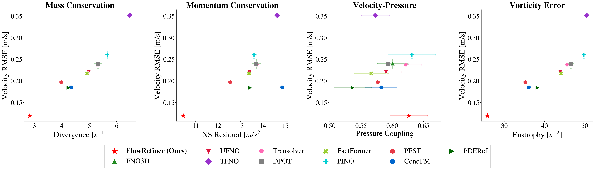
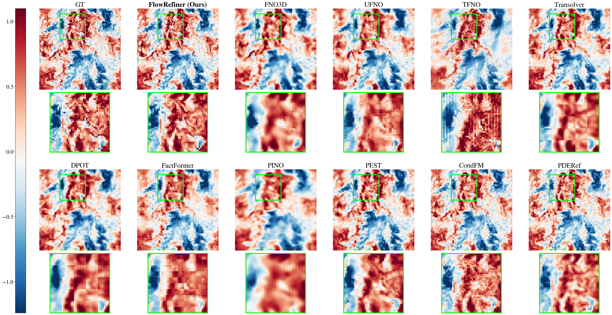
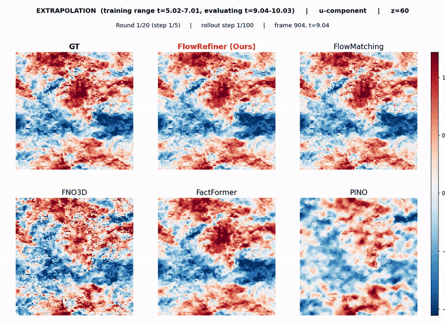

<p align="center">
<h1 align="center"><strong>🌊 FlowRefiner: Flow Matching-Based Iterative Refinement<br>for 3D Turbulent Flow Simulation</strong></h1>
  <p align="center">
    <a>Yilong Dai<sup>1</sup>,</a>
    <a>Yiming Sun<sup>2</sup>,</a>
    <a>Yiheng Chen<sup>1</sup>,</a>
    <a>Shengyu Chen<sup>2</sup>,</a>
    <a>Xiaowei Jia<sup>2</sup>,</a>
    <a>Runlong Yu<sup>1,†</sup></a>
    <br>
    <sup>1</sup>University of Alabama, <sup>2</sup>University of Pittsburgh<br>
    <sup>†</sup>Corresponding author
  </p>

<p align="center">
  <a href="https://arxiv.org/abs/2604.17149" target="_blank">
    
  </a>
  <a href="https://github.com/Dyloong1/FlowRefiner" target="_blank">
    
  </a>
  <a href="https://github.com/Dyloong1/FlowRefiner/blob/main/LICENSE" target="_blank">
    
  </a>
</p>

<p align="center">
  
</p>

## Overview

Autoregressive prediction of 3D turbulent flows is hard because small errors in fine-scale structures accumulate rapidly during rollout. Existing diffusion-style refiners (e.g. PDE-Refiner) inherit DDPM pathologies when ported to 3D turbulence:

1. **Noise–depth coupling** — the standard schedule ties early-step noise magnitude to total refinement depth $K$.
2. **Regression-target discontinuity** — the base predictor regresses toward the physical solution but refinement steps regress toward injected noise.
3. **Variance accumulation** — fresh stochastic noise is injected at every refinement stage even though Navier–Stokes dynamics are deterministic.

**FlowRefiner** addresses all three with a single design:

* A **deterministic ODE-based correction** in place of stochastic denoising, using a small number of Euler substeps.
* A **unified velocity-field regression objective** (normalized to unit variance) that is semantically consistent across every refinement level $k$.
* A **decoupled sigma schedule** `fixed_range` that bounds the perturbation range ($\sigma_{\max}=0.01$, $\sigma_{\min}=0.001$) independently of the refinement depth $K$.

Empirically, FlowRefiner achieves state-of-the-art AR accuracy on forced isotropic turbulence (JHTDB FIT, $128^3$) while matching the physical consistency of physics-informed baselines — **without any explicit divergence or Navier–Stokes supervision**.

## Key Results

Per-round AR RMSE on **FIT** (forced isotropic turbulence, $128^3$), lower is better:

| Configuration        | R1        | R2        | R3        |
|----------------------|-----------|-----------|-----------|
| $K{=}0$ (base)       | 0.0772    | 0.1030    | 0.1207    |
| Linear ($K{=}1$)     | 0.0921    | 0.1211    | 0.1411    |
| Cprod ($K{=}1$)      | 0.0900    | 0.1142    | 0.1335    |
| Cprod-large ($K{=}1$)| 0.0919    | 0.1215    | 0.1381    |
| **Decoupled $K{=}2$**| **0.0709**| **0.0933**| **0.1085**|
| Decoupled $K{=}4$    | 0.0712    | 0.0939    | 0.1095    |

With $N{=}2$ Euler ODE substeps the decoupled $K{=}2$ configuration reaches R1 = **0.0693** (an additional 2.3% gain).

<p align="center">
  
</p>

<p align="center">
  
</p>

FlowRefiner (red star) sits closest to the lower-left corner in every physics panel, meaning best accuracy *and* best or competitive physical consistency.

<p align="center">
  
</p>

### 100-step extrapolation rollout

Beyond the 3-round protocol in the paper, we stress-test FlowRefiner on a **100-step** autoregressive rollout in a time window that lies **outside the training range** (train: $t \in [5.02, 7.01]$; eval: $t \in [9.04, 10.03]$). Every baseline ends up collapsed to its own attractor (white-noise texture for the from-noise FM baseline, high-frequency checkerboards for the spectral operators, block artefacts for the attention operator). FlowRefiner is the only method that keeps evolving along the true Navier–Stokes manifold.

<p align="center">
  
</p>

> $u$-component at $z{=}60$ across 100 autoregressive steps (20 rounds × 5 frames). Panels: GT, FlowRefiner (ours), FlowMatching, FNO3D, FactFormer, PINO.

## Installation

```bash
git clone https://github.com/Dyloong1/FlowRefiner.git
cd FlowRefiner
pip install -r requirements.txt
```

Tested with **PyTorch 2.1+** and a single NVIDIA GPU. Peak VRAM for the main setting (`K=2`, `N=2` ODE substeps, `batch_size=1`, gradient checkpointing on) is ≈17 GB; a 24 GB card is sufficient with room to spare. We developed the model on an RTX 5090.

## Data

FlowRefiner trains on two benchmarks. Only **FIT** is required to reproduce the main result.

| Dataset | Grid            | Channels  | Source                                       |
|---------|-----------------|-----------|----------------------------------------------|
| FIT     | $128\times128\times128$ | $u,v,w,p$ | Forced isotropic turbulence, JHTDB [[link]](http://turbulence.pha.jhu.edu) |
| TGV     | $64\times128\times128$  | $u,v,w,p$ | Taylor–Green vortex (decaying)               |

**Download.** Both pre-processed datasets (FIT `.npy` cubes and TGV frames) are available at: https://drive.google.com/drive/folders/1M6GJl8dGodToLKJYaNvJzglKoWMdhrkX?usp=drive_link

**Expected layout.** Each channel and frame is stored as a single `.npy` file.

```
<DATA_DIR>/
  u_5.020.npy   v_5.020.npy   w_5.020.npy   p_5.020.npy
  u_5.030.npy   v_5.030.npy   ...
  ...
```

For FIT, timestamps range from `5.02` to `7.01` in steps of `0.01` (200 frames). The AR train/val/test split is `Dataset/jhu_data_splits_ar.json`; we use the same continuous test chunks for every experiment. For TGV, frames are `img_{u,v,w,p}_dns{idx}.npy` with `idx` in `0..161` (162 frames); the split is `Dataset/dns_data_splits_ar.json`.

Normalization statistics (per-channel mean and std, computed on the training split) ship with the repo in `Dataset/{jhu,dns}_normalization_stats.json`.

## Quick Start

### Training modes

`train.py` supports **two** training strategies. Both land on the same final configuration: **K=2 + `fixed_range` sigma schedule (σ_max=0.01, σ_min=0.001) + N=2 ODE substeps**, which is the paper's best setting.

| Mode         | What it does                                                                 | Schedule             | Paper result |
|--------------|------------------------------------------------------------------------------|----------------------|--------------|
| `two_stage`  | (1) pretrain base predictor with `K=0` for 150 ep, (2) fine-tune at `K=2` with the decoupled schedule for 50 ep | 150 ep + 50 ep       | **recommended**: reaches R1 RMSE ≈ 0.0693 on FIT |
| `joint`      | Train `K=2 fixed_range` directly from scratch for 200 ep                     | 200 ep single stage  | simpler; a bit behind `two_stage` at equal budget |

Why two_stage is preferred: `K=0` pretraining produces a strong base predictor, and the FM refinement branch ($k \geq 1$) only has to learn small corrections on top of an already good forecast. Joint training is a one-command alternative that removes the extra bookkeeping.

Pick a mode and run:

```bash
# Paper's best setting (recommended)
DATA_DIR=/path/to/JHU_DNS128 MODE=two_stage bash scripts/train_jhu.sh

# Or train K=2 jointly from scratch
DATA_DIR=/path/to/JHU_DNS128 MODE=joint    bash scripts/train_jhu.sh
```

You can also drive `train.py` directly. The two-stage recipe is:

```bash
# Stage 1 -- K=0 pretrain (150 epochs)
python train.py \
    --data_source jhu --data_dir /path/to/JHU_DNS128 \
    --refiner_steps 0 --sigma_schedule ddpm \
    --epochs 150 --checkpoint_dir checkpoints/flowrefiner_jhu_K0

# Stage 2 -- K=2 fixed_range fine-tune (50 epochs)
python train.py \
    --data_source jhu --data_dir /path/to/JHU_DNS128 \
    --refiner_steps 2 --sigma_schedule fixed_range \
    --sigma_max 0.01 --sigma_min 0.001 --ode_steps 2 \
    --epochs 50 --checkpoint_dir checkpoints/flowrefiner_jhu_K2_ft \
    --finetune checkpoints/flowrefiner_jhu_K0/latest.pt
```

And the joint recipe (one command):

```bash
python train.py \
    --data_source jhu --data_dir /path/to/JHU_DNS128 \
    --refiner_steps 2 --sigma_schedule fixed_range \
    --sigma_max 0.01 --sigma_min 0.001 --ode_steps 2 \
    --epochs 200 --checkpoint_dir checkpoints/flowrefiner_jhu_K2_joint
```

### Evaluation

Pass the same scheduler flags you used at training time so the scheduler is reconstructed correctly.

```bash
python evaluate.py \
    --data_source jhu --data_dir /path/to/JHU_DNS128 \
    --checkpoint_dir checkpoints/flowrefiner_jhu_K2_ft --ckpt_type best \
    --refiner_steps 2 --sigma_schedule fixed_range \
    --sigma_max 0.01 --sigma_min 0.001 --ode_steps 2
```

`evaluate.py` runs the 3-round autoregressive protocol over the held-out chunks, reports per-round and per-channel RMSE, SSIM, RelL2, and physics consistency (`div_max`, `div_mean`, `dE_pct`), and saves JSON results under `results/`.

### TGV

```bash
DATA_DIR=/path/to/TGV_data MODE=two_stage bash scripts/train_dns.sh
CKPT_DIR=checkpoints/flowrefiner_dns_K2_fixed_range_ft \
  DATA_DIR=/path/to/TGV_data  bash scripts/evaluate_jhu.sh
```

## Method Summary

**Setup.** Given $T_\text{in}=5$ input frames $\mathbf{S}_t=[\mathbf{s}_{t-4}, \ldots, \mathbf{s}_t]$ with $\mathbf{s}=[u,v,w,p]$, predict the next $T_\text{out}=5$ frames $\mathbf{Y}_t$ autoregressively over $R$ rounds.

**Architecture.** A single step-conditioned `RefinerUNet3D` (hidden = 64, channel mults $(1,2,2,4)$, 2 residual blocks per level, 50.4 M parameters) serves both as base predictor ($k{=}0$) and as refinement network ($k{\geq}1$).

**Training objective.** At step $k{=}0$ the network regresses to the clean flow block with MSE. For $k{\geq}1$, sample $\tau\sim\mathcal{U}[0,1]$, noise level $\sigma_k$ from the decoupled schedule, interpolate

$$ \mathbf{y}_\tau = (1-\tau)\,(\mathbf{y} + \sigma_k\boldsymbol\varepsilon) + \tau\,\mathbf{y}, $$

and train the shared network to predict the **unit-variance velocity** $\mathbf{v}_\theta=(\mathbf{y}-\mathbf{y}_\tau)/\sigma_k=-\boldsymbol\varepsilon$. All refinement levels now share the same unit-variance target.

**Inference.** At each refinement step $k$ run $N=2$ Euler substeps from $\tau=0$ to $\tau=1$. For the schedule, use `fixed_range` with $\sigma_{\max}=0.01$, $\sigma_{\min}=0.001$ — these bounds are **independent of $K$**, which is what allows increasing refinement depth without enlarging the perturbation range.

See the paper for the full derivation and all ablations (sigma schedule, refinement depth $K$, ODE substeps $N$, projection strategies, noise priors, reduced temporal context).

## Repository Layout

```
FlowRefiner/
├── Model/
│   ├── models/
│   │   ├── flowrefiner_model.py    # FlowRefiner wrapper + FM scheduler
│   │   └── unet_backbone.py        # 3D U-Net backbone (RefinerUNet3D)
│   └── configs/flowrefiner_config.py
├── Dataset/
│   ├── jhu_dataset.py              # FIT loader
│   ├── sparse_dataset.py           # TGV loader
│   ├── jhu_data_splits_ar.json     # 3-round AR split (FIT)
│   ├── dns_data_splits_ar.json     # 2-round AR split (TGV)
│   └── {jhu,dns}_normalization_stats.json
├── utils/
│   ├── noise_generators.py         # White / Kolmogorov / div-free priors
│   ├── physics_utils.py            # Divergence, Leray projection, etc.
│   └── metrics.py                  # 3D SSIM
├── scripts/
│   ├── train_jhu.sh  train_dns.sh  evaluate_jhu.sh
├── train.py                        # Training entry point
├── evaluate.py                     # 3-round AR evaluation
├── requirements.txt
└── README.md
```

## Reproducing Paper Numbers

To reproduce the best FlowRefiner number (R1 RMSE = 0.0693 on FIT):

```bash
# Full two-stage training (~20-24 h on one RTX 5090, batch_size=1)
DATA_DIR=/path/to/JHU_DNS128 MODE=two_stage bash scripts/train_jhu.sh

# Evaluate with K=2, fixed_range, N=2 ODE substeps
CKPT_DIR=checkpoints/flowrefiner_jhu_K2_fixed_range_ft \
DATA_DIR=/path/to/JHU_DNS128 bash scripts/evaluate_jhu.sh
```

Expected AR RMSE (averaged over all FIT test chunks), matching the paper's Table 3 (ODE substeps ablation, $K{=}2$, $N{=}2$):

```
round_1    RMSE = 0.0693
round_3    RMSE = 0.1060
```

(Round 2 RMSE and per-round SSIM are not reported in the paper; see the JSON dumped by `evaluate.py` for the full set of per-round, per-channel metrics.)

## Citation

```bibtex
@misc{dai2026flowrefinerflowmatchingbasediterative,
      title={FlowRefiner: Flow Matching-Based Iterative Refinement for 3D Turbulent Flow Simulation},
      author={Yilong Dai and Yiming Sun and Yiheng Chen and Shengyu Chen and Xiaowei Jia and Runlong Yu},
      year={2026},
      eprint={2604.17149},
      archivePrefix={arXiv},
      primaryClass={physics.flu-dyn},
      url={https://arxiv.org/abs/2604.17149},
}
```

## Acknowledgements

The 3D U-Net backbone (`RefinerUNet3D`) follows the PDE-Refiner / pdearena codebase (Lippe et al., 2024) and is reimplemented here in 3D. We thank the JHTDB team for releasing the forced isotropic turbulence dataset.
